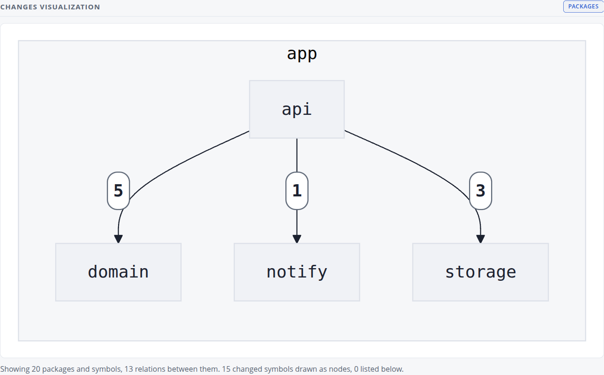
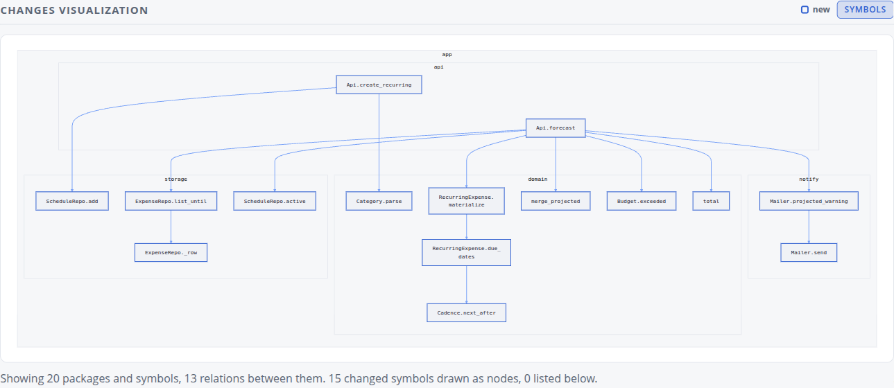
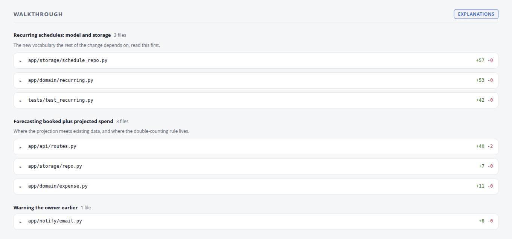
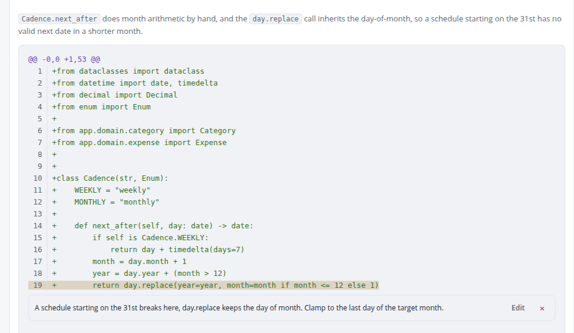
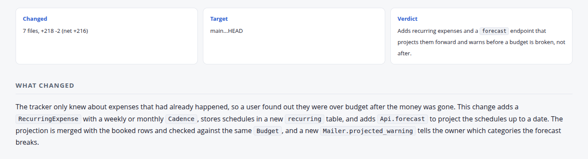
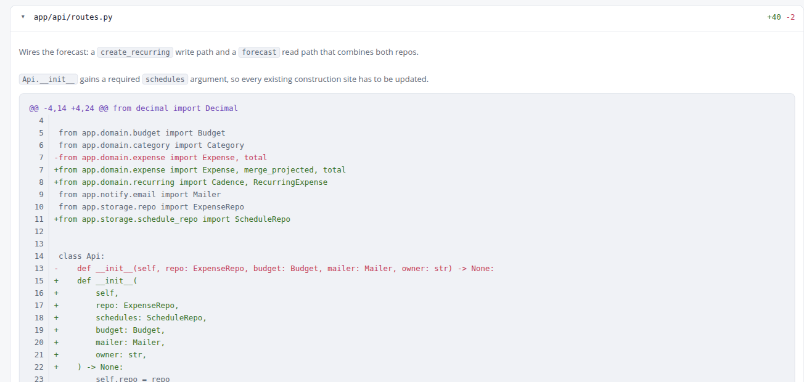

# crisperit-skills

Agent skills I use on real work, packaged so you can install them. One so far,
human-review.

## human-review

Point it at a git diff, a commit range, a branch or a GitHub PR. It produces a
markdown recap for the PR description and a self-contained HTML review page you
open locally.

```
/human-review                 # working tree plus staged changes
/human-review this branch     # main...HEAD
/human-review 123             # that PR
/human-review HEAD~3..HEAD
```

### Why

It exists to make human review faster and more thorough, because that is where
real defects still get caught. When I review a PR by hand I do the same three
things every time, and the diff helps with none of them:

**1. I estimate coupling by reading what imports what.** That is how you find
the blast radius of a change, and doing it by hand across seven files is slow
and easy to get wrong. human-review derives the import and call graph by parsing
the code itself, not by asking a model to guess it from the diff text, and draws
it at two levels. Packages first:



Then the same graph at symbol level, so you can see which new function actually
has fan-out and which are leaves:



**2. I group the changed files by feature and read them in that order.** A
GitHub file list is alphabetical, which is never the order the change makes
sense in. So human-review groups the files into themes, puts the theme a reviewer
needs first at the top, and orders files inside a group caller before callee.



**3. I take notes per line, then turn them into review comments.** Comments sit
on the diff lines they are about, and each one has a button that posts it to the
PR. Nothing leaves the page unless you click it.



Anything else a reviewer works out in their head could go on the page instead.
If you have a habit like these three, open an issue. A review aid that saves ten
minutes per PR is worth building.

### The rest of the page

A facts strip, a summary, and a mermaid flow diagram of the change:



Each file carries a one-line role, each hunk a note on what the code does, above
the diff itself:



The screenshots above come from a small demo Python service, on a branch adding
recurring expenses and a budget forecast.

Nothing is published. The page stays a local file unless you pass `--pr` or ask
for it to be hosted.

### Flags

| Flag | Effect |
|---|---|
| (default) | both outputs, markdown recap and HTML page |
| `--md-only` | skip the HTML page |
| `--html-only` | skip the markdown |
| `--recap-only` | prose only, no graphs, cheapest run |
| `--pr [<number>]` | also write the recap into the PR description |

### Prerequisites

- `python3`, standard library only, nothing to install
- `git`
- `gh`, only to target a PR or post comments
- optional, for the graphs: `tree-sitter-language-pack`, `go`, or a language
  server, depending on the language. See below.

### Language support

Everything built from the diff itself works in any language: the grouping and
reading order, the annotated walkthrough, per-line comments, the markdown recap
and the flow diagram.

The graphs have to parse the code. Python, Go, JavaScript and TypeScript need
nothing installed. `pip install tree-sitter-language-pack` adds the symbol graph
for Rust, Java, Ruby, Kotlin, Swift, Scala, C, C++, C#, PHP, Lua, Elixir and
Julia. The interactive symbol level graph on the page needs more: `go` on
PATH for Go, or `pyright-langserver`, `typescript-language-server` or
`rust-analyzer` for Python, TypeScript and Rust. Where a parser is missing the
graph sections are skipped and the page says so, nothing else changes.

## Install

<details>
<summary><strong>Claude Code</strong></summary>

```
/plugin marketplace add crisperit/crisperit-skills
/plugin install crisperit-skills
```

</details>

<details>
<summary><strong>Any other harness</strong></summary>

A skill is a directory with a `SKILL.md` in it, so anything that reads that
format picks it up.

```bash
git clone https://github.com/crisperit/crisperit-skills.git
cd crisperit-skills
./install.sh                            # ~/.claude/skills
./install.sh ~/.config/some-harness/skills
```

`install.sh` symlinks rather than copies, so `git pull` updates what you have
installed.

</details>

## License

MIT
