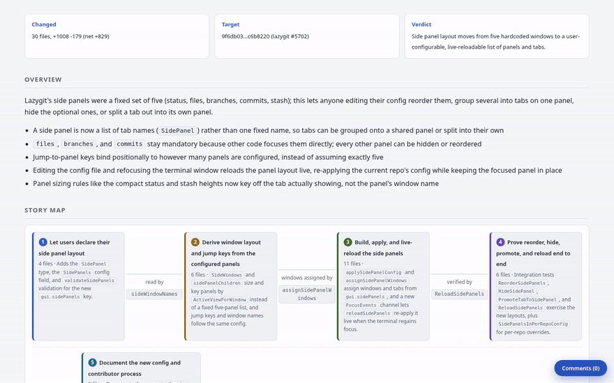

# crisperit-skills

Agent skills I use on real work, packaged so you can install them. One so far,
code-walkthrough.

## code-walkthrough

Turns a diff, a PR, or a part of the codebase you want explained into a page
you read top down, from the big picture to the exact lines.

[](https://crisperit.github.io/crisperit-skills/demo/lazygit-5702.html)

**[Open the live example](https://crisperit.github.io/crisperit-skills/demo/lazygit-5702.html)**,
lazygit PR [#5702](https://github.com/jesseduffield/lazygit/pull/5702), "Make the
side panels configurable": 30 files, +1008 -179, one `/code-walkthrough` run.
Click any diff line to leave a comment.

```
/code-walkthrough                          # working tree plus staged changes
/code-walkthrough this branch              # main...HEAD
/code-walkthrough 123                      # that PR
/code-walkthrough HEAD~3..HEAD
/code-walkthrough explain the auth flow    # code as it stands, no change needed
```

### Why

Agents write code faster than anyone can read it now, so reading and
responding is the bottleneck, not writing. A unified diff is a bad surface to
read on. It hands you 30 files in alphabetical order and leaves you to build
the picture yourself, bottom up.

When you explain a change to someone, you say what it does, then the steps it
takes, then what it touches, and only then point at lines. code-walkthrough
builds the page in that order, so by the time you reach a line of code you
already know where it sits.

### Top down, one question per level

1. **Overview: what changed, and why.** Two sentences and a few bullets, no
   file names. On the example: lazygit's side panels stop being a fixed five
   and become a list you configure.
2. **Story map: in what order does it happen.** The files grouped into three
   to five themes, drawn as stops in the order the story runs. Each hop names
   the function that hands off to the next stop. On the example: declare the
   config, derive the layout, build and live-reload it, prove it end to end.
3. **System change: what does it touch.** The types and functions the diff
   touched, callers on the left and callees on the right, coloured by story
   stop. Parsed from the code at both refs; no model is involved. Go and
   TypeScript for now.
4. **Call graph: how far does it reach.** Per theme, the call graph resolved
   by the compiler or a language server, at package and symbol level. That
   shows the blast radius: which new function is called from everywhere and
   which is a leaf.
5. **Code: the lines, with the reason beside them.** Each file gets a one line
   role and each hunk a note on what the code does. Inside a theme, callers
   come before callees.
6. **Respond: send it back.** Comment on any line. Copy for agent hands the
   whole set to the assistant to act on, Copy gh command prints the calls to
   post them as PR review comments. The page has no server, so nothing leaves
   it unless you copy it. The page is a local file and only gets hosted if
   you ask.

If you work something out in your head on every review that could live on this
page, open an issue.

### What a run costs

The example PR took about 7 minutes and roughly 490k tokens, all on Sonnet
subagents, in one measured run. The per-hunk reading fans out to parallel
subagents; the main session only orchestrates, and neither the diff nor the
page ever enters its context. The graphs come from parsers and take seconds.

### Prerequisites

- `python3`, standard library only, nothing to install
- `git`
- `gh`, only to target a PR or post comments
- optional, for the graphs: `tree-sitter-language-pack`, `go`, or a language
  server, depending on the language. See below.

### Language support

Everything built from the diff itself works in any language: the grouping and
reading order, the annotated walkthrough, per-line comments and the flow
diagram.

The graphs have to parse the code. Python, Go, JavaScript and TypeScript need
nothing installed. `pip install tree-sitter-language-pack` adds the symbol graph
for Rust, Java, Ruby, Kotlin, Swift, Scala, C, C++, C#, PHP, Lua, Elixir and
Julia. The interactive symbol level graph on the page needs more: `go` on
PATH for Go, or `pyright-langserver`, `typescript-language-server` or
`rust-analyzer` for Python, TypeScript and Rust. Where a parser is missing the
graph sections are skipped and the page says so, nothing else changes.

## Install

<details>
<summary><strong>Claude Code</strong></summary>

```
/plugin marketplace add crisperit/crisperit-skills
/plugin install crisperit-skills
```

</details>

<details>
<summary><strong>Any other harness</strong></summary>

A skill is a directory with a `SKILL.md` in it, so anything that reads that
format picks it up.

```bash
git clone https://github.com/crisperit/crisperit-skills.git
cd crisperit-skills
./install.sh                            # ~/.claude/skills
./install.sh ~/.config/some-harness/skills
```

`install.sh` symlinks rather than copies, so `git pull` updates what you have
installed.

</details>

## License

MIT
