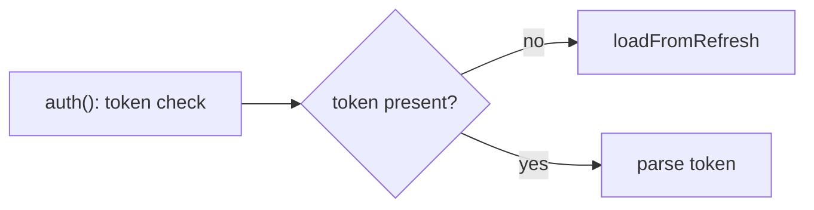

# How the markdown recap is shaped, and why

**Nothing here is a task.** `scripts/render.py --format md` builds the recap; SKILL.md step 3
has the command. This file is background: what survives GitHub's sanitizer, and the reasons
behind the parts that look arbitrary. Read it when changing `render.py` or `walkthrough.py`.

The only thing a model contributes is `analysis.json` (schema in SKILL.md step 2). Same style
rule as everywhere else: apply no-ai-slop if available, otherwise plain sentences, no dashes,
no filler.

GitHub strips CSS, JavaScript and almost all raw HTML from PR bodies. Only these constructs
survive its sanitizer, confirmed against `gh api --method POST /markdown -f mode=gfm` output:

| Construct | Rendered as |
|---|---|
| ` ```mermaid ` fence | `highlight-source-mermaid`, drawn as an SVG client-side in the PR view |
| `<details>` + `<summary>` | passed through verbatim |
| ` ```diff ` fence | `highlight-source-diff` with per-line added/removed spans |
| markdown table | `<table>` |
| unicode bar `████░░` | literal text, no CSS needed |

The class prefix is `highlight-source-X`, not `language-X`; checking for the wrong prefix
gives a false stripped verdict. The `/markdown` endpoint returns pre-JavaScript HTML, so a
mermaid block correctly comes back as highlighted source rather than an SVG: GitHub's
client-side renderer draws the diagram in the actual PR, this is expected, not a failure.

Everything from the HTML page that has no CSS equivalent gets translated, not copied:

- `.facts` becomes a short bold line or a 3-row table.
- `.dstat` bars become unicode blocks, `████░░░░`, scaled per row against the largest file
  (max 10 blocks), same scaling rule as the HTML builder.
- `details.hunk` becomes one `<details>` per file.

## Linking, from `links.json`

When `links.json` was handed to you and its `head_pushed` is true, make the reader's next
click cheap:

- File table: the path cell becomes `[path](diff_url)`, landing on that file in the PR's Files
  changed tab.
- Walkthrough: each file's `<summary>` keeps the plain path (a `summary` with a link in it is
  a fight between opening the block and following the link), and the file's `role` line below
  it ends with `[view in PR](diff_url)`.
- Each hunk's note ends with `[L<start>-L<end>](hunk url)`, the permalink to those lines at
  the head commit, so a reader who wants the surrounding code is one click away.
- Nothing else gets linked. A recap where every noun is a link is harder to read than one
  with none.

Skip all of it when `head_pushed` is false or `repo_url` is empty: those links 404. These are
links back into the same PR and repo, not published content, so the no-publishing rule still
holds.

The recap never names a local filesystem path, a scratch directory, or a temp file. Every
reader of a pull request description is on someone else's machine, so a path like
`/tmp/claude-.../human-review-AO-4.html` means nothing to them and exposes a local directory
layout besides. Point at the PR's own Files changed tab instead, the same place the links
above already point.

## Two escaping rules that silently break the page

1. **A fenced block inside `<details>` needs a blank line after `</summary>`**, or GitHub
   renders the fence as literal backticks instead of parsing it. Confirmed: the same fence
   with the blank line produces `highlight-source-diff` markup, without it the output
   contains the literal characters `` ```diff ``.
2. **Mermaid labels still need quoting, diff content must not be HTML-escaped.** A label
   containing `(`, `)`, `:`, `#` or a quote goes in double quotes inside the node, for
   example `A["auth(): early return"]`. Diff lines taken from `raw.diff` are written as
   plain text inside the ` ```diff ` fence: GitHub's own renderer escapes `<`, `>` and `&`
   for display. Escaping them here first produces double-escaped output like `&amp;lt;`.

## What the recap contains

A long PR description is worse than none, reviewers scroll past it to reach Files changed. Order
runs orientation, then concepts, then detail. Every row is either arithmetic, a string from
`analysis.json`, or a section file pasted byte for byte.

| Part | Source |
|---|---|
| Bold facts line: file count, net delta, target | `raw.diff` and `target` |
| One line under it | `verdict` |
| Prose, one paragraph per blank-line-separated block | `what_changed` |
| ` ```mermaid ` fence, never inside a `<details>` so it renders on sight | `flow_mermaid` |
| `### How it works` | `how_it_works` |
| Symbol delta, two fenced diagrams, packages then symbols | `section-symbols.md` |
| Walkthrough | `walkthrough.py --format md` |
| `[Files changed]` link | `links.json` |

Any blank source omits its part, heading and all, rather than leaving a placeholder.

Notes on the rows that look arbitrary:

- **Two fenced blocks here, one interactive toggle in HTML.** GitHub cannot run the page's
  level switcher, so markdown gets both pre-rendered levels back to back instead, packages
  first: which packages and symbols exist is the context that makes the narrower symbols view
  mean anything.
- **The section file is pasted, never regenerated.** It already carries its own heading, fences
  and caption from `sections.py`. Retyping a diagram is how a legend drifts from its arrows.
  `validate_analysis.py --sections` checks its marker survived.
- **The recap never names a local path.** Every reader of a PR description is on someone else's
  machine, so a scratch directory means nothing to them and leaks a directory layout besides.
- **No local `raw.diff` path in a footer either**, unlike the HTML page, which is local by
  definition.

## The walkthrough, and the two budgets

`walkthrough.py --format md` emits **hunk notes and no hunk bodies**. A PR description is the
high-level view and GitHub renders the real diff directly below it, so repeating the bodies is
duplication that eats the whole budget: on a 76-file branch, bodies came to 440845 characters,
notes to 12201. The local HTML page carries every body and the section says so. `--hunks full`
exists and will blow the budget on anything but a small diff.

There is no separate file table: a table listing the same paths immediately above the same paths
is one section too many, so each file's `<summary>` is the inventory. A file silently missing
reads as a file not touched, and the script cannot miss one, it reads the diff rather than the
analysis. `validate_analysis.py --rendered` re-checks the assembled result.

Two budgets, and they have to add up. `render.MAX_BODY_CHARS` (45000) is the readable ceiling for
the whole recap; GitHub's hard limit is 65536 and it refuses a longer body outright.
`walkthrough.DEFAULT_MAX_CHARS` (32000) is the walkthrough's share, sized so the prose and the
symbols graph fit in the rest.

The walkthrough is the part that gives, because it is the only part that scales with file count.
Over budget it ranks files least-interesting-last, lockfiles and generated output first, then
tests, then smallest, keeps the full treatment for as many of the top as fit, and collapses the
tail into one `<details>` listing path, counts and role. The tail carries no links: a blob url
runs 110 characters, so linking 76 tail files spends 8400 on urls while the budget is busy
truncating the content they point at. `render.py` warns on stderr if the total is still over.

Every file still appears by path, so nothing is silently dropped and
`validate_analysis.py --rendered` still passes, since that gate only checks that each changed
file's path appears somewhere in the output.

## Describe, not judge

This recap says what the code does and why it's shaped that way. It does not grade the
change: never assert a defect, rank severity, or recommend a fix, and drop "should",
"consider", "worth confirming" and "make sure" from the vocabulary, they turn a description
into a verdict. If something in the diff genuinely looks broken, raise it with the user
directly in the conversation, not in this artifact - a judgment call sitting inside a PR
description reads as a review that already happened, pre-empting the human reviewer this
description is written for and duplicating what `core:code-review`, `check-pr` and `fix-pr`
already do on purpose.

## Worked example

The outer fence below uses four backticks only so this reference doc can show three-backtick
fences nested inside it; a real generated section uses plain three-backtick fences.

````markdown
## Visual diff recap

Auth session lookup now falls back to the refresh token instead of forcing a
re-login when the access token has expired. One file changed.



`loadFromRefresh()` reads the refresh token from the same session store `auth()` already
uses for the access token, and returns a freshly parsed session in the same shape `parse()`
produces, so callers see no difference between the two paths.

| File | + | - | |
|---|---|---|---|
| auth.ts | 2 | 2 | `████████` |

<details>
<summary>Walkthrough</summary>

<details>
<summary>auth.ts (+2 -2)</summary>

Falls back to the refresh token instead of returning null on a missing access token.

```diff
@@ -1,4 +1,4 @@
 export function auth(token: string) {
-  if (!token) return null;
+  if (!token) return loadFromRefresh();
   return parse(token);
 }
```

Clears the cached session on the same path, so a stale session never survives a refresh.

```diff
@@ -18,3 +18,4 @@ export function loadFromRefresh() {
   const session = store.refresh();
+  sessionCache.delete(session.userId);
   return session;
 }
```

</details>

</details>
````

## PR body wiring

Write the section wrapped in idempotency markers:

```
<!-- visual-diff:start -->
... generated section ...
<!-- visual-diff:end -->
```

To refresh an existing PR description: read the current body with
`gh pr view <n> --json body --jq .body`, splice the wrapped section into it, then write back
with `gh pr edit <n> --body-file <file>`. Always `--body-file`, never `--body` with an inline
string, bodies contain backticks, newlines and quotes that shell quoting mangles.

Do not build this with `re.sub(pattern, wrapped, body)`. A string replacement in `re.sub`
processes backslash escapes (`\1`, `\g<name>`), and the generated section can contain
backslash sequences that are not group references at all, such as a Windows path in a diff
line (`C:\1\Users`) or a regex literal (`\d+`) quoted from the code under review. `re.sub`
raises `re.error: invalid group reference` on those, and a walkthrough of real code hits them
routinely. The unanchored pattern is a second, worse defect: matched anywhere in the body, a
non-greedy `.*?` spans from the first start marker to the first end marker, so if a human ever
pastes the literal marker syntax as an example above the generated section, everything
between that illustrative pair and the real one is silently destroyed.

Use a slice-based splice instead. It never touches the replacement-string escaping path, and
line-anchoring plus taking the last match keeps an illustrative pair earlier in the body from
being eaten:

```python
import pathlib, re

START, END = "<!-- visual-diff:start -->", "<!-- visual-diff:end -->"
# Anchored to whole lines so a marker quoted inside a code fence cannot open a match,
# and the last pair wins so an illustrative pair earlier in the body is left alone.
PAIR = re.compile(rf"^{re.escape(START)}$.*?^{re.escape(END)}$", re.S | re.M)

def _neutralise(section: str) -> str:
    # A bare marker at column 0 inside the section would close the region early and make
    # refreshes non-idempotent, appending the tail again each time. One leading space
    # renders identically (an indented HTML comment is still an invisible comment) and no
    # longer matches the line-anchored pattern.
    return "\n".join(
        f" {ln}" if ln.strip() in (START, END) else ln
        for ln in section.splitlines()
    )

def splice(body: str, section: str) -> str:
    wrapped = f"{START}\n{_neutralise(section.strip())}\n{END}"
    body = body.rstrip("\n")
    matches = list(PAIR.finditer(body))
    if matches:
        m = matches[-1]
        merged = body[: m.start()] + wrapped + body[m.end() :]
    else:
        merged = f"{body}\n\n{wrapped}" if body else wrapped
    return merged.rstrip("\n") + "\n"
```

`gh pr view --json body --jq .body` pipes through `jq -r`, which appends a trailing newline
that is not part of the stored body; reading, writing and reading again without stripping it
would drift by one newline per refresh. `splice` above closes that gap itself: it
`rstrip("\n")`s the incoming body before matching and emits exactly one trailing newline, so
a second application on its own output is byte-identical.

`scripts/test_markers.py`, next to this file, is the source of truth for `splice`: it holds
the same implementation shown above and asserts each of the cases described here, including
the `re.sub` backslash bug and the illustrative-marker case. Run it with
`python3 scripts/test_markers.py` after touching this logic, and keep the two in sync rather
than letting this doc's copy drift from the script's.
